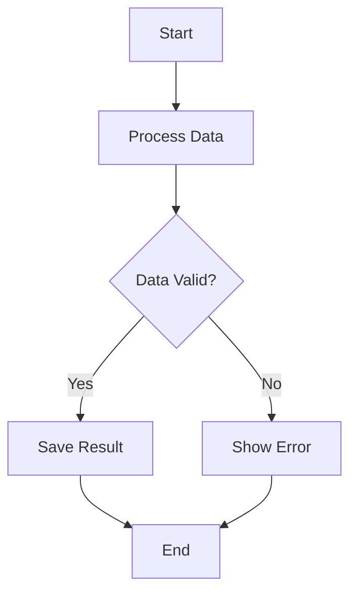
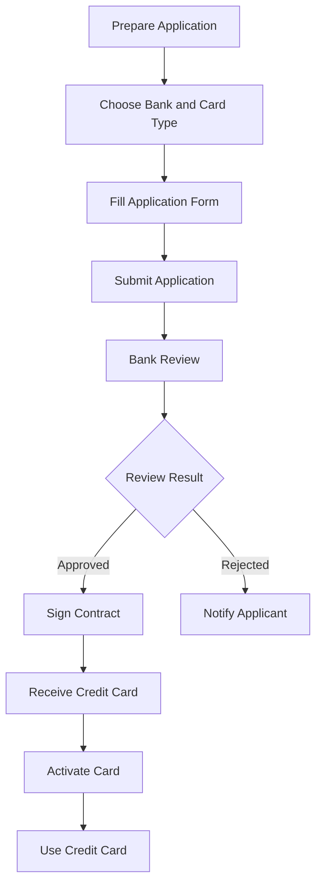
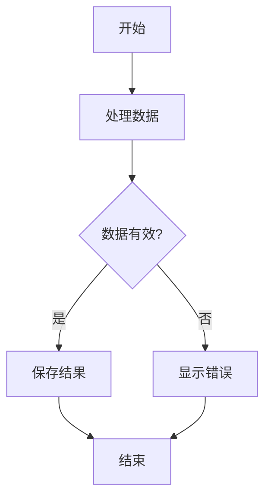
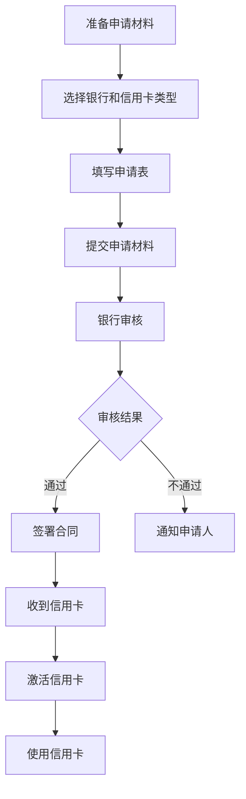

# FlowMap - Advanced Flowchart Generator Plugin for Dify

**Author:** sawyer-shi  
**Email:** sawyer36@foxmail.com  
**Version:** 0.0.1  
**Type:** Dify Plugin  
**Repository:** [GitHub](https://github.com/sawyer-shi/dify-plugins-flow_map)

### Version Information

- **Current Version**: v0.0.1
- **Release Date**: 2025-09-12
- **Compatibility**: Dify Plugin Framework
- **Python Version**: 3.12+

#### Version History
- **v0.0.1** (2025-09-12): Initial release with smart branch detection, colorful arrow labels, and advanced layout optimization

## Description

A powerful flowchart generation plugin that converts Markdown and Mermaid syntax to beautiful, intelligent flowcharts with advanced layout optimization and branch-aware positioning.

## ✨ Key Features

- 🎨 **Intelligent Layout System**
  - Smart branch detection and free layout for complex flowcharts
  - Grid layout for linear processes
  - Automatic canvas sizing to prevent element overflow
  
- 📐 **Multiple Layout Directions**
  - Left-to-right layout (LR)
  - Top-to-bottom layout (TB)
  - Branch-aware positioning
  
- 🌈 **Colorful Arrow Labels**
  - Intelligent color mapping based on label semantics
  - Support for Chinese and English labels
  - Customizable color themes
  
- 📝 **Dual Format Support**
  - Full Mermaid syntax support with labeled arrows
  - Markdown list conversion
  - Automatic text type detection
  
- 🎭 **Rich Themes**
  - Modern theme with gradient effects
  - Business professional theme
  - Classic minimalist theme
  - Custom theme support
  
- 🔧 **Local Processing**
  - **Local Generation**: Mind maps generated locally, no API Key required, no external network or services needed
  - **Secure & Reliable**: Data stays private, completely offline processing, protects user privacy
  - No external API dependencies
  - Fast generation with matplotlib
  - Privacy-focused design
  - High-quality PNG output

## 🚀 Quick Start

1. **Download from Dify Plugin Marketplace**
   - Go to Dify Plugin Marketplace
   - Search and download `flow_map` plugin
   - Enable FlowMap plugin in your workspace

2. **LLM Integration** ⭐
   - Add an LLM node in your Dify workflow
   - Use the simplest prompt: **"Summarize user input #context# into Mermaid flowchart text format"**
   - Connect LLM output to FlowMap plugin input

### Basic Usage Examples

**Simple Mermaid Flowchart**


**Branching Decision Flow**


## 📚 API Reference

### Mermaid Left-Right Tool

**Input Parameters:**
- `text` (string, required): Mermaid syntax flowchart text
- `theme` (string, optional): Theme name (modern/business/classic)

**Output:**
- Success: PNG image + text summary
- Format: "Successfully generated left-right layout flowchart. File size: X.XXM. Contains X nodes and X connections."

### Mermaid Top-Bottom Tool

**Input Parameters:**
- `text` (string, required): Mermaid syntax flowchart text
- `theme` (string, optional): Theme name (modern/business/classic)

**Output:**
- Success: PNG image + text summary
- Format: "Successfully generated top-bottom layout flowchart. File size: X.XXM. Contains X nodes and X connections."

## 🛠️ Advanced Features

### Smart Branch Detection

The plugin automatically detects branching scenarios in your flowchart and switches layout algorithms:

- **Linear Flow**: Uses grid layout for optimal alignment
- **Branching Flow**: Uses free layout to prevent overlap

### Colorful Arrow Labels

Supports labeled arrows with intelligent color mapping:

```mermaid
F -->|Approved| G    # Green arrow for positive outcomes
F -->|Rejected| H    # Red arrow for negative outcomes
F -->|Pending| I     # Orange arrow for pending states
```

### Theme Customization

Available themes with different visual styles:

- **Modern**: Clean design with gradients
- **Business**: Professional corporate style
- **Classic**: Traditional minimalist look

## 🔧 Development

### Project Structure

```
flow_map/
├── tools/                  # Core tools implementation
│   ├── mermaid_lr.py      # Left-right layout tool
│   ├── mermaid_tb.py      # Top-bottom layout tool
│   └── optimized_layout.py # Advanced layout engine
├── provider/              # Provider configurations
├── test/                  # Comprehensive tests
├── manifest.yaml          # Plugin manifest
├── main.py               # Entry point
└── README.md             # Documentation
```

### Building Plugin

```bash
# From project root directory
.\dify-plugin-windows-amd64.exe plugin package .\flow_map

# This will create flow_map-0.0.1.difypkg
```


## 🔍 Technical Details

### Branch-Aware Layout Algorithm

- **Branch Detection**: Automatically identifies decision nodes with multiple outgoing connections
- **Free Layout**: Hierarchical positioning based on connection levels
- **Canvas Adaptation**: Dynamic canvas sizing (up to 2.5x node count)
- **Collision Avoidance**: Smart spacing with 70% effective area usage

### Performance Optimization

- **Matplotlib Backend**: High-quality vector graphics
- **Memory Efficient**: Local processing without external APIs
- **Fast Rendering**: Optimized for complex flowcharts

## 📄 License

This project is licensed under the MIT License - see the LICENSE file for details.

## 🤝 Support

If you encounter any issues or have questions:

1. 📖 Check the documentation
2. 🔍 Search existing issues on GitHub
3. 🆕 Create a new issue with detailed description
4. 💬 Join our community discussions
5. 📧 Email: sawyer36@foxmail.com

## 🙏 Acknowledgments

- Matplotlib team for the excellent plotting library
- Mermaid.js community for inspiration
- Dify platform for the plugin framework

---

# FlowMap - 高级流程图生成器插件

**作者:** sawyer-shi  
**邮箱:** sawyer36@foxmail.com  
**版本:** 0.0.1  
**类型:** Dify插件  
**仓库:** [GitHub](https://github.com/sawyer-shi/dify-plugins-flow_map)

### 版本信息

- **当前版本**: v0.0.1
- **发布日期**: 2025-09-12
- **兼容性**: Dify插件框架
- **Python版本**: 3.12+

#### 版本历史
- **v0.0.1** (2025-09-12): 初始发布版本，包含智能分支检测、彩色箭头标签和高级布局优化功能

## 描述

一个强大的流程图生成插件，将Markdown和Mermaid语法转换为美观、智能的流程图，具有高级布局优化和分支感知定位功能。

## ✨ 核心功能

- 🎨 **智能布局系统**
  - 智能分支检测和复杂流程图自由布局
  - 线性流程网格布局
  - 自动画布尺寸防止元素溢出
  
- 📐 **多种布局方向**
  - 左右布局
  - 上下布局
  - 分支感知定位
  
- 🌈 **彩色箭头标签**
  - 基于标签语义的智能颜色映射
  - 支持中英文标签
  - 可定制颜色主题
  
- 📝 **双格式支持**
  - 完整Mermaid语法支持，包含标签箭头
  - Markdown列表转换
  - 自动文本类型检测
  
- 🎭 **丰富主题**
  - 现代渐变主题
  - 商务专业主题
  - 经典简约主题
  - 自定义主题支持
  
- 🔧 **本地处理**
  - **本地生成**: 脑图在本地生成，无需API Key，无需链接外部网络或服务
  - **安全可靠**: 数据不外泄，完全离线处理，保护用户隐私
  - 无外部API依赖
  - matplotlib快速生成
  - 注重隐私设计
  - 高质量PNG输出

## 🚀 快速开始

1. **从Dify插件市场下载**
   - 进入Dify插件市场
   - 搜索并下载 `flow_map` 插件
   - 在您的工作区中启用FlowMap插件

2. **LLM集成** ⭐
   - 在Dify工作流中添加LLM节点
   - 使用最简单的提示词：**"将用户输入#context#总结为Mermaid流程图文本格式"**
   - 将LLM输出连接到FlowMap插件输入

### 基本使用示例

**简单Mermaid流程图**


**分支决策流程**


## 📚 API参考

### Mermaid左右布局工具

**输入参数:**
- `text` (字符串，必需): Mermaid语法流程图文本
- `theme` (字符串，可选): 主题名称 (modern/business/classic)

**输出:**
- 成功: PNG图像 + 文本摘要
- 格式: "Successfully generated left-right layout flowchart. File size: X.XXM. Contains X nodes and X connections."

### Mermaid上下布局工具

**输入参数:**
- `text` (字符串，必需): Mermaid语法流程图文本
- `theme` (字符串，可选): 主题名称 (modern/business/classic)

**输出:**
- 成功: PNG图像 + 文本摘要
- 格式: "Successfully generated top-bottom layout flowchart. File size: X.XXM. Contains X nodes and X connections."

## 🛠️ 高级功能

### 智能分支检测

插件自动检测流程图中的分支场景并切换布局算法：

- **线性流程**: 使用网格布局实现最优对齐
- **分支流程**: 使用自由布局防止重叠

### 彩色箭头标签

支持带标签的箭头和智能颜色映射：

```mermaid
F -->|通过| G    # 正面结果使用绿色箭头
F -->|不通过| H  # 负面结果使用红色箭头
F -->|待定| I    # 待定状态使用橙色箭头
```

### 主题定制

可用主题及不同视觉风格：

- **现代**: 清洁的渐变设计
- **商务**: 专业企业风格
- **经典**: 传统简约外观

## 🔧 开发

### 项目结构

```
flow_map/
├── tools/                  # 核心工具实现
│   ├── mermaid_lr.py      # 左右布局工具
│   ├── mermaid_tb.py      # 上下布局工具
│   └── optimized_layout.py # 高级布局引擎
├── provider/              # 提供者配置
├── test/                  # 综合测试
├── manifest.yaml          # 插件清单
├── main.py               # 入口点
└── README.md             # 文档
```

### 构建插件

```bash
# 从项目根目录执行
.\dify-plugin-windows-amd64.exe plugin package .\flow_map

# 这将创建 flow_map-0.0.1.difypkg 文件
```


## 🔍 技术细节

### 分支感知布局算法

- **分支检测**: 自动识别具有多个出向连接的决策节点
- **自由布局**: 基于连接层级的分层定位
- **画布适配**: 动态画布尺寸（最多2.5倍节点数）
- **碰撞避免**: 70%有效区域使用率的智能间距

### 性能优化

- **Matplotlib后端**: 高质量矢量图形
- **内存高效**: 本地处理无外部API
- **快速渲染**: 为复杂流程图优化

## 📄 许可证

本项目采用MIT许可证 - 详见LICENSE文件。

## 🤝 支持

如果遇到问题或有疑问：

1. 📖 查看文档
2. 🔍 在GitHub上搜索现有问题
3. 🆕 创建新问题并详细描述
4. 💬 加入社区讨论
5. 📧 邮箱: sawyer36@foxmail.com

## 🙏 致谢

- 感谢Matplotlib团队提供的优秀绘图库
- 感谢Mermaid.js社区的启发
- 感谢Dify平台提供的插件框架